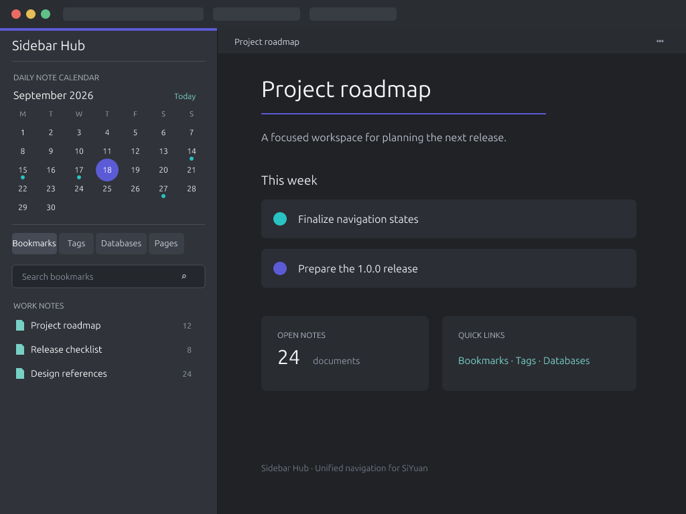

<p align="center">
  
</p>
<p align="center">
  
</p>

# 侧边抽屉

[English](./README.md)

“侧边抽屉”把日记、书签、标签、数据库和普通页面集中到一个紧凑的思源 Dock 中，提供更快捷的统一导航入口，同时保留思源官方侧边栏面板。

## 功能

### 日记月历

- 在紧凑的月历中标记已有日记。
- 点击日期直接打开已有日记。
- 可以直接选择年份、月份，并随时回到今天。
- 跳过没有日记的日期，打开最近的上一篇或下一篇已有日记。
- 今日日记不存在时，经确认后通过思源原生流程创建。

月历使用插件设置中选择的一个日记笔记本。该笔记本必须处于打开状态，并且已经在思源中配置日记存放路径。插件不会创建缺失的过去或未来日记。

### 聚合导航标签页

- **书签：**按书签值分组，支持分组折叠和数量显示，可按名称、创建时间或修改时间排序。
- **标签：**以可折叠树展示，并显示精确引用数量。仅用于组织后代的虚拟父标签不会打开搜索结果，可按名称或引用数量排序。
- **数据库：**列出属性视图并显示数据库记录总数，优先定位数据库块，失败时回退到所在文档，可按名称排序。
- **页面：**扫描所有已打开笔记本中的普通文档，排除日记及日记路径上的祖先文档；显示文档引用数量，可按名称、创建时间或修改时间排序。

每个标签页都有独立的搜索、排序、刷新、加载、空状态和错误状态。搜索支持输入多个关键词。需要额外查询的计数会在列表出现后异步补齐，不阻塞首屏导航。

### 偏好与无障碍

- 可以单独隐藏或显示标签页，并始终保证至少保留一个标签页。
- 持久化当前标签页、排序方式、书签分组折叠状态和标签路径折叠状态。
- 收到思源相关笔记本或文档变更时，自动刷新受影响的数据来源。
- 适配思源亮色和暗色主题。
- 标签页、日期、菜单、工具栏和导航条目均提供键盘操作与辅助技术语义。

## 运行要求

- 思源笔记 `3.8.0` 或更高版本。
- 桌面端、桌面浏览器或从页签分离出的桌面窗口前端。

插件不支持移动端前端，也不包含 Kernel Plugin。由于导航依赖私有工作空间数据和桌面 Dock 交互，插件在思源发布服务中处于禁用状态。

## 安装

### 思源集市

打开 **设置 → 集市 → 插件**，搜索 **侧边抽屉**，安装后在 **已下载** 中启用。

### 手动安装

1. 从最新的 [GitHub Release](https://github.com/gowithmoon/siyuan-plugin-sidebar-hub/releases/latest) 下载 `package.zip`。
2. 解压到 `<工作空间>/data/plugins/siyuan-plugin-sidebar-hub/`，确保 `plugin.json` 直接位于该目录中。
3. 重启思源或重新加载插件，然后启用“侧边抽屉”。

## 开始使用

1. 启用插件，点击左侧 Dock 上半区的网格图标。
2. 打开插件设置，选择用于日记的笔记本。
3. 使用月历打开日记，或切换到书签、标签、数据库和页面标签页。
4. 使用各标签页工具栏进行搜索、排序、刷新，以及展开或折叠支持的分组。

对于文档很多的工作空间，首次页面扫描和异步计数可能需要稍长时间。加载提示或数量位置的 `…` 表示结果尚未确认，并不表示数量为零。

## 开发

需要 Node.js 24 或更高版本，以及 pnpm 11.4。

```bash
pnpm install --frozen-lockfile
pnpm run dev
```

提交或交付前运行：

```bash
pnpm run check
pnpm test
pnpm run build
```

### 部署到本地工作空间

复制环境变量示例，并将 `SIYUAN_PLUGINS_DIR` 设置为思源工作空间的 `data/plugins` 绝对路径：

```bash
cp .env.example .env.local
pnpm run release
```

例如：

```dotenv
SIYUAN_PLUGINS_DIR=/home/user/SiYuan/data/plugins
```

系统环境变量优先于 `.env.local`。该本地文件已被 Git 忽略，不要提交个人工作空间路径。

### 构建安装包

```bash
pnpm run make-install
```

生产构建会生成 `dist/` 和 `package.zip`。这些文件是构建产物，不应手工修改或提交。

## 隐私

“侧边抽屉”只通过思源本地 API 读取当前工作空间中的导航数据，不会把工作空间内容发送到外部服务，也不包含遥测。

## 许可

[MIT](./LICENSE)
